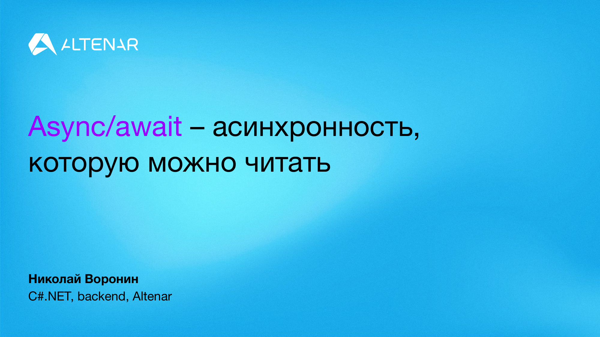

# Async/await – асинхронность, которую можно читать

В 2026 году про асинхронность написано совсем все. Поэтому давайте на минуту выдохнем и вспомним:

- какую реальную боль async/await решает
- как распутывали спагетти код асинхронных методов
- что происходит, когда пишем await
- и заглянем в будущее, ведь async2 уже в этом году

Без копания в исходниках и рантайме до посинения, зато с выравниванием понимания: что такое асинхронность как модель, а не набор ключевых слов.



__Место проведения:__ Vladimir Tech Talks #37, г. Владимир, ул. Гагарина 5, этаж 4, [конф. зал Альтенара](https://yandex.ru/maps/-/CDQlNY~U).

18 Сентября 2026 года. ▶ [Видео... уже почти здесь]

## План

- Больше потоков ≠ быстрее
- Потоки – дорогие
- Как посчитать быстрее? Параллельно!
- Асинхронность – способ не держать поток
- .NET до нашей эры
- Task
- Механика исполнения "на пальцах"
- Механика в коде C#
- Планирование "продолжения"
- Токен отмены
- Обработка исключений
- Зеленые потоки и async2
- Выводы и ссылки для копания глубже

### Доп. секция

- Continuation-passing style

## Вопросы

▶ [Видео... уже почти здесь]

- Можно ли провести параллели между async и Thread?
- Ведь не совсем кооперативная отмена?
- Единичный вызов асинхронной функции не даст прироста производительности?
- Почему короткие названия для Task-async-await, но длинные для того же CancellationTokenSource?

## Hints

### Get PNG slides with Poppler

```shell
pdftoppm -png -r 200 -sep "" -progress ".\async-code-you-can-actually-read.pdf" ".\slides\"
```

This produces a series of PNG files in the `.\slides\` directory, such as: `01.png`, `02.png`, ...

Or, if you want to use prefixes and separators:

```shell
pdftoppm -png -r 200 -sep "~" -progress ".\async-code-you-can-actually-read.pdf" ".\slides\foo"
```

This produces a series of PNG files, such as: `foo~01.png`, `foo~02.png`, ...

### Install Poppler

```shell
winget install -e --id oschwartz10612.Poppler
```

Verify the installation:

```shell
> pdftoppm -v

pdftoppm version 25.07.0
Copyright 2005-2025 The Poppler Developers - http://poppler.freedesktop.org
Copyright 1996-2011, 2022 Glyph & Cog, LLC
```
